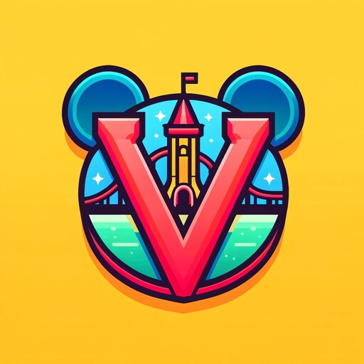

 

  

<h3 align="center">VentureLibs - Your journey awaits!</h3>
<h4 align="center">Official Partner of <a href="https://themeparkcraft.com">ThemeParkCraft!</a></h4>

  

    A Minecraft Theme Park Plugin for Spigot and Paper
     
    Tribute to Craftventure <3
     
    <a href="https://discord.com/users/216487432667791360"><strong>Contact »</strong></a>
     
     
    <a href="https://discord.gg/m27MDData7">Discord-Server</a>
    ·
    <a href="https://weblate.flawcra.cc/engage/blockventureplugin/">
      Help us translate the server!
      
    </a>
  

 
 

## Developer Documentation

We are working on providing all the needed informations for development on
our [KTDocs](https://docs.blockventuremc.net).
If you feel like there is something missing, feel free
to [open a issue](https://github.com/BlockVentureMC/VentureLibs/issues/new)
